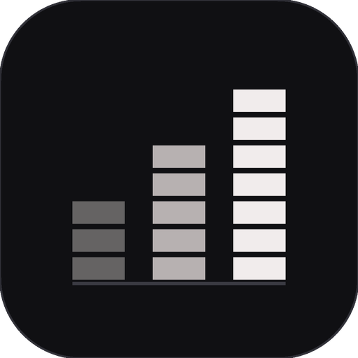
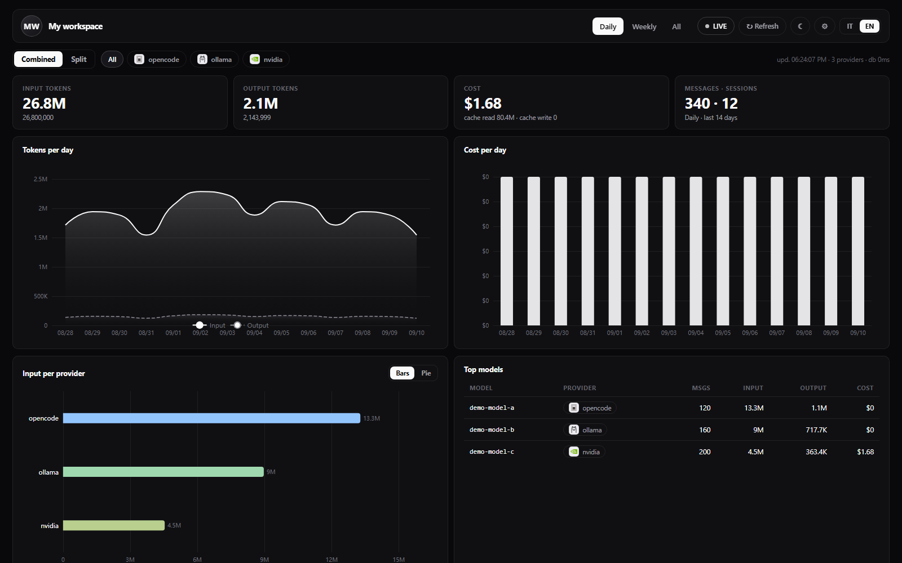
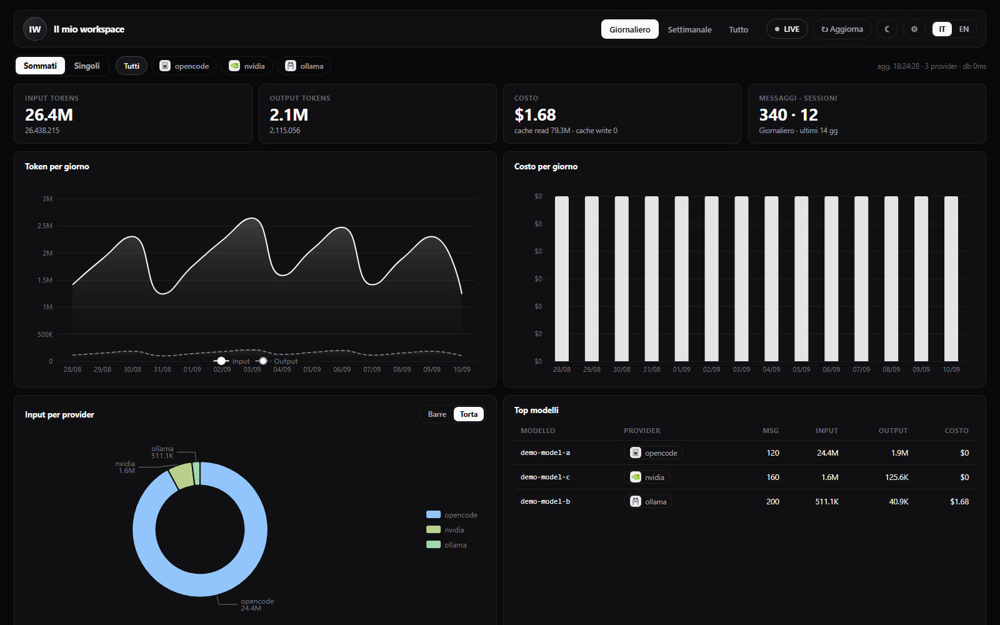
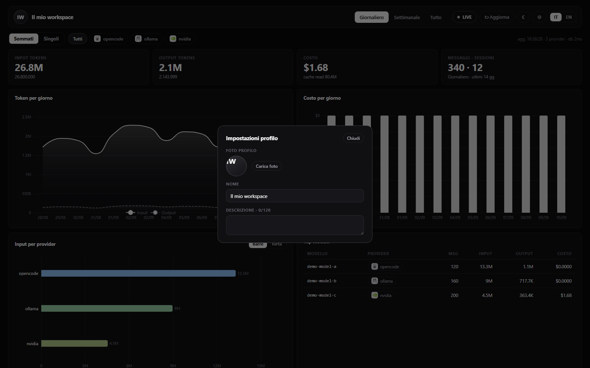
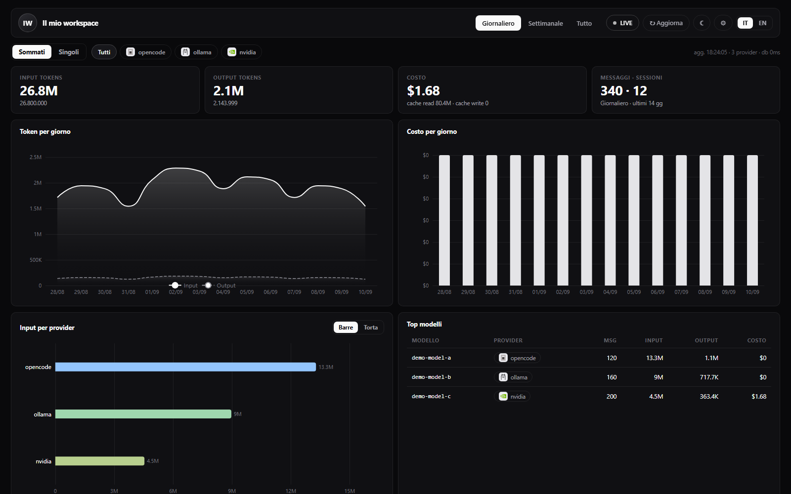

# OpenCode Stats

Lightweight desktop dashboard for your OpenCode usage — tokens, costs, charts.\
*Tauri v2 · ~10 MB .exe · ~30 MB RAM · EN/IT*

[](./LICENSE)


&nbsp;·&nbsp;
[](#opencode-stats) [](#italiano)

**⬇️ [Download v0.1.6](https://github.com/terzastella/opencode-stats/releases)** — Windows setup + portable `.exe`.

<br />



<br />

| | |
|---|---|
| 📊 | Input/output tokens, cost, cache — daily, weekly, all-time |
| 📈 | Line, bar & donut charts, top models, recent sessions |
| 🎛️ | Per-provider filters, Combined / Split views, brand icons |
| 👤 | Customizable profile (photo, name, bio), light/dark theme |
| 🌍 | English + Italian interface |
| 🔒 | 100% local: read-only DB access, no keys, no auth, no telemetry |

<br />

<details>
<summary><b>Install & release notes</b></summary>
<br />

Download `OpenCode Stats_*_x64-setup.exe` (recommended) or the `.msi` from
[Releases](https://github.com/terzastella/opencode-stats/releases).
Requires Windows 10/11 x64 with WebView2 (usually preinstalled) and OpenCode
used at least once (the app reads its local database).

> The app is not code-signed: Windows shows "unknown publisher" — that's expected.
> On SmartScreen: "More info → Run anyway".

**v0.1.6** — fixed provider-filter crash (backend/frontend field naming
mismatch); selection stats hardened against shape drift.
**v0.1.5** — "OpenCode is not installed" screen with IT/EN switch; readable
sub-dollar cost axis; Terzastella publisher + custom installer icons;
release build scrubbed of machine paths.
</details>

<details>
<summary><b>More screenshots</b></summary>
<br />



*Donut view (toggle Bars / Pie on the card)*

<br />



*Profile settings (photo, name, bio)*
</details>

<details>
<summary><b>How data works</b></summary>
<br />

It reads `~/.local/share/opencode/opencode.db` read-only (`OPENCODE_DB_PATH` override —
on Windows: `%USERPROFILE%\.local\share\opencode\opencode.db`):

- `message.data` (JSON: `role/providerID/modelID/tokens/cost`) → KPIs, daily/weekly, per-provider split
- `session` (`cost/tokens_*` aggregates) → recent sessions list

Providers used through OpenCode (`opencode/*`, `ollama/*`, `lmstudio/*`, `llama.cpp/*`, …)
are filterable with **Combined / Split** views and stable per-provider colors.

The app is OpenCode-only: it only reads its database — no API keys, no auth,
no network (localhost only). Original files are only ever read.
No telemetry of any kind.
</details>

<details>
<summary><b>Development & build</b></summary>
<br />

```powershell
npm install
npm run tauri dev      # app + hot reload (live data from your opencode.db)
```

Without Tauri (`npm run dev`) the UI shows a warning because Rust invokes are unavailable.
`npm run dev` + `?demo` opens a demo dataset (also handy for screenshots).

```powershell
npm run tauri build
# -> src-tauri/target/release/opencode-stats.exe
# -> src-tauri/target/release/bundle/nsis/OpenCode Stats_0.1.6_x64-setup.exe (+ .msi)
```

For published releases, build with `scripts/build-release.ps1` instead: same output,
but scrubs build-machine paths from the binary via `--remap-path-prefix`.

> Note: if you change icons or `tauri.conf.json` and the exe doesn't pick them up,
> delete `src-tauri/target/release/build/opencode-stats-*/` before rebuilding:
> Tauri's build script (Windows resources/icons) doesn't always re-run on its own
> and would link stale resources. `cargo clean -p` alone is not enough.
</details>

<details>
<summary><b>Project structure & legal</b></summary>
<br />

- `src-tauri/src/stats.rs` — read-only SQLite queries + `db_info/session_list/dashboard/selection_stats` commands
- `src/lib/` — `api.ts`, `types.ts`, `format.ts`, `profile.ts` (`localStorage` profile), `providers.ts` (stable provider colors), `brand.tsx` (provider logos), `i18n.ts` (EN/IT), `demo.ts` (`?demo` dataset)
- `src/App.tsx` — dashboard: KPIs, ECharts charts (tokens/cost/per-provider bars+donut), top models, sessions
- Silent refresh every 30 s (pausable) + refresh on focus, light/dark theme, Daily (14 d) / Weekly (8 wks) / All ranges

Provider icons come from [Simple Icons](https://simple-icons.org) v16.30.0 (CC0, bundled locally —
no external loading). Additional marks vectorized from official sources:
[OpenCode brand](https://opencode.ai/brand) (MIT project, also for Zen),
[Groq logo](https://commons.wikimedia.org/wiki/File:Groq_logo.svg) and
[Cerebras logo](https://commons.wikimedia.org/wiki/File:Cerebras_logo.svg) via Wikimedia
Commons (referential use: they only identify the token source in your statistics).
All trademarks belong to their respective owners.
</details>

---

## Italiano

*🇮🇹 Versione italiana — [English](#opencode-stats) sopra · [⬇️ Download v0.1.6](https://github.com/terzastella/opencode-stats/releases)*

Dashboard desktop leggera (**Tauri v2**, `.exe` ~10 MB, ~30 MB RAM) per le statistiche di
utilizzo di OpenCode: input/output tokens, costo, viste giornaliere/settimanali/tutto,
grafici e tabelle, profilo personalizzabile, interfaccia EN/IT.

<br />



<br />

| | |
|---|---|
| 📊 | Token input/output, costi, cache — giornaliero, settimanale, tutto |
| 📈 | Grafici linee, barre e torta, top modelli, sessioni recenti |
| 🎛️ | Filtri per provider, viste Sommati / Singoli, loghi brand |
| 👤 | Profilo personalizzabile (foto, nome, bio), tema chiaro/scuro |
| 🌍 | Interfaccia inglese + italiano |
| 🔒 | 100% locale: sola lettura DB, niente chiavi, niente telemetria |

<br />

<details>
<summary><b>Installazione e note di release</b></summary>
<br />

Scarica `OpenCode Stats_*_x64-setup.exe` (consigliato) o il `.msi` dalle
[Release](https://github.com/terzastella/opencode-stats/releases).
Richiede Windows 10/11 x64 con WebView2 (di solito già presente) e OpenCode
già usato almeno una volta (l'app legge il suo database locale).

> L'app non è firmata digitalmente: Windows mostra "autore sconosciuto" — è normale.
> Su SmartScreen: "Ulteriori informazioni → Esegui comunque".

**v0.1.6** — corretto il crash alla selezione di un provider (nomi dei campi
disallineati tra backend e frontend); statistiche di selezione più robuste.
**v0.1.5** — schermata "OpenCode non installato" con selettore IT/EN; tacche
leggibili sull'asse dei costi sotto il dollaro; publisher Terzastella + icone
installer; build release ripulita dai percorsi macchina.
</details>

<details>
<summary><b>Altri screenshot</b></summary>
<br />


*Vista torta (toggle Barre / Torta sulla card)*

<br />


*Pannello impostazioni profilo*
</details>

<details>
<summary><b>Come funzionano i dati</b></summary>
<br />

Legge in read-only `~/.local/share/opencode/opencode.db` (override con `OPENCODE_DB_PATH` —
su Windows: `%USERPROFILE%\.local\share\opencode\opencode.db`):

- `message.data` (JSON: `role/providerID/modelID/tokens/cost`) → KPI, daily/weekly, split per provider
- `session` (aggregati `cost/tokens_*`) → lista sessioni recenti

I provider usati via OpenCode (`opencode/*`, `ollama/*`, `lmstudio/*`, `llama.cpp/*`, …)
sono filtrabili con vista **Sommati / Singoli** e colori stabili per provider.

L'app è dedicata a OpenCode: legge solo il suo database, niente chiavi API,
niente auth, niente rete (solo localhost). I file originali sono sempre e solo letti.
Nessuna telemetria di alcun tipo.
</details>

<details>
<summary><b>Sviluppo e build</b></summary>
<br />

```powershell
npm install
npm run tauri dev      # app + hot reload (dati live dal tuo opencode.db)
```

Senza Tauri (`npm run dev`) l'UI mostra un avviso perché gli invoke Rust non sono disponibili.
`npm run dev` + `?demo` apre un dataset dimostrativo (comodo anche per screenshot).

```powershell
npm run tauri build
# -> src-tauri/target/release/opencode-stats.exe
# -> src-tauri/target/release/bundle/nsis/OpenCode Stats_0.1.6_x64-setup.exe (+ .msi)
```

Per le release pubblicate, compila invece con `scripts/build-release.ps1`: stesso output,
ma ripulisce i percorsi della macchina di build dal binario via `--remap-path-prefix`.

> Nota: se cambi icone o `tauri.conf.json` e l'exe non li recepisce, cancella
> `src-tauri/target/release/build/opencode-stats-*/` prima di rebuildare:
> lo script di build di Tauri (risorse Windows/icons) non sempre si ri-esegue
> da solo e linkerebbe risorse vecchie. `cargo clean -p` da solo non basta.
</details>

<details>
<summary><b>Struttura progetto e note legali</b></summary>
<br />

- `src-tauri/src/stats.rs` — query SQLite read-only + comandi `db_info/session_list/dashboard/selection_stats`
- `src/lib/` — `api.ts`, `types.ts`, `format.ts`, `profile.ts` (profilo in `localStorage`), `providers.ts` (colori stabili per provider), `brand.tsx` (loghi provider), `i18n.ts` (EN/IT), `demo.ts` (dataset `?demo`)
- `src/App.tsx` — dashboard: KPI, grafici ECharts (token/costo/per-provider barre+torta), top modelli, sessioni
- Refresh silenzioso ogni 30 s (pausabile) + refresh su focus, tema chiaro/scuro, range Giornaliero (14 gg) / Settimanale (8 sett) / Tutto

Le icone dei provider vengono da [Simple Icons](https://simple-icons.org) v16.30.0 (CC0, bundle
locale — nessun caricamento esterno). Marchi aggiuntivi vettorializzati dalle fonti
ufficiali: [OpenCode brand](https://opencode.ai/brand) (progetto MIT, anche per Zen),
[logo Groq](https://commons.wikimedia.org/wiki/File:Groq_logo.svg) e
[logo Cerebras](https://commons.wikimedia.org/wiki/File:Cerebras_logo.svg) da Wikimedia
Commons (uso referenziale: identificano solo
la sorgente dei token nelle tue statistiche). Tutti i marchi citati appartengono ai
rispettivi proprietari.
</details>
